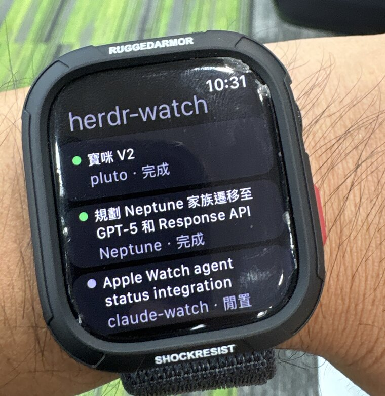
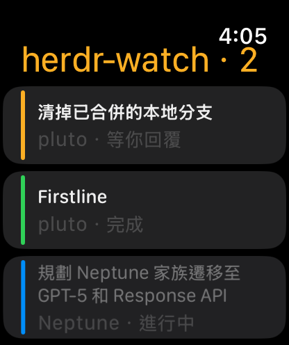

# herdr-watch

Agent status from [herdr](https://herdr.dev) on an Apple Watch.

<p>
  
  
</p>

## Install

### Paste this at your coding agent

Claude Code · Codex · Cursor. Run it on the machine where herdr and the agents
actually live, not on a laptop attached with `herdr --remote`.

```text
Set up herdr-watch on this machine. It serves herdr's agent roster to an Apple Watch.

1. Check prerequisites first and stop if any fail: `herdr --version` is 0.8.0 or
   newer, `~/.config/herdr/herdr.sock` exists (herdr must be running), and
   `node --version` is 18 or newer.

2. Clone https://github.com/Unayung/herdr-watch into ~/Projects/herdr-watch and run
   `npm test`. Both self-checks must print ok. There is nothing to npm install —
   the project has no dependencies.

3. Start the bridge. Copy systemd/herdr-watch-bridge.service into
   ~/.config/systemd/user/, and if node is not at a system path, put its absolute
   path in ExecStart — systemd does not read my shell profile. Then
   `systemctl --user enable --now herdr-watch-bridge` and confirm
   `curl -s localhost:7860/health` returns {"ok":true}.

4. Wire up Claude Code's hooks with `node setup-hooks.js`, then show me what
   changed. It backs the settings file up first and leaves other tools' hooks in
   place, but I want to see it.

5. Notifications are separate and optional. If I give you a Bark key, copy
   systemd/herdr-watch.service, put the key after Environment=BARK_KEY=, and enable
   it the same way. Without a key it runs as a dry run and prints instead.

6. Do not publish the bridge. A watch cannot join a tailnet, so it will eventually
   need a public hostname, but that decision is mine: what you would be exposing is
   a service that types into my terminal. Tell me which routes this machine could
   take — `tailscale funnel --bg 7860`, or a cloudflared ingress rule pointing at
   127.0.0.1:7860 — and wait.

7. When I ask for the pairing code, print
   `cat ~/.local/state/herdr-watch/pair-code`. It rotates every ten minutes and
   dies after five wrong guesses.

The watch app needs a Mac you can't reach from here: `xcodegen generate` in watch/,
then Xcode, a development team, and a paired Apple Watch.
```

### Or by hand

```bash
git clone https://github.com/Unayung/herdr-watch && cd herdr-watch
npm test && node bridge.js          # prints the pair-code path
node setup-hooks.js                 # --remove to undo
```

### Requirements

Herdr 0.8.0+, Node 18+, and an agent herdr already detects. No npm install, no
native module, no runtime dependency.

For the watch app: macOS with Xcode 16, xcodegen, an Apple developer account, and
an Apple Watch on watchOS 10 or newer. For notifications: the Bark app, or a few
lines' edit for ntfy or anything else that takes a POST.

---

herdr owns the roster and the state machine (which agents exist, where, and whether
they are `working` / `blocked` / `done`). Claude Code hooks own the detail (what a
prompt is actually asking). They join on the Claude session UUID: a hook's
`session_id` is the same value herdr stores as `agent_session.value` for that pane.

So the line falls in the middle of an agent. Anything herdr detects — and it knows
about twenty-odd kinds — shows up in the roster with its status, its title and its
screen, gets a push when it blocks or finishes, and takes keystrokes back. What
needs Claude Code is the labelled buttons: the question and its options arrive
through the `PermissionRequest` hook, and nothing else emits one. On another agent
you still see it waiting and can still answer by number, but you read the options
off its own screen rather than off a button.

Two smaller places assume Claude Code as well: the screen-cleaning rule was tuned
against its layout, and the buttons send a bare digit because that is what selects
an option there. Neither is load-bearing enough to break another agent's roster.

Mixed machines get told which is which: rows name their agent as soon as the roster
holds more than one kind, and stay quiet about it when everything is the same.

Everything in the data path runs on the machine hosting the agents. A laptop
attached with `herdr --remote` is a terminal client, not part of the path.

```
herdr.sock ───> herdr-notify ──> Bark push ──> phone ──> wrist
           └──> bridge ──> SSE over Tailscale Funnel ──> watch app
Claude Code hooks ──┘
```

Two ways in, because they cover different moments. Push reaches you when the app is
closed, which on watchOS is nearly always — the OS will not hold a socket open in
the background. The app is for when you raise your wrist and want the whole board.

Where this could go next — a phone page, and what open-sourcing the watch app would
take: [ROADMAP.md](ROADMAP.md).

## Push — `herdr-notify.js`

```bash
BARK_KEY=<key> node herdr-notify.js      # push on blocked / done
node herdr-notify.js                     # no key: dry run, prints instead
npm test                                 # self-checks for both services
```

| Env | Default | |
|---|---|---|
| `BARK_KEY` | — | unset means dry run |
| `BARK_SERVER` | `https://api.day.app` | |
| `HERDR_SOCKET_PATH` | `~/.config/herdr/herdr.sock` | |
| `POLL_MS` | `3000` | |
| `BRIEF_LINES` / `BRIEF_CHARS` | `12` / `400` | how much screen rides along |

The notification carries the tail of the pane, so you can tell from your wrist
whether it needs you. Raw screens are kept in `~/.local/state/herdr-watch/samples`
— the text-cleaning rule should be retuned against real captures, not guesses.

`done` means idle after unseen background work; focusing the tab in herdr marks it
seen. Startup takes a baseline and does not push for agents already sitting in
`blocked` or `done`.

## Bridge — `bridge.js`

```bash
node bridge.js                   # 127.0.0.1:7860
node setup-hooks.js              # point Claude Code at it (--remove to undo)
npm run pair                     # the 6-digit code the watch asks for
```

Publishing it is the one part that has to reach the open internet, because a watch
cannot join a tailnet. Two routes, and the second is what actually shipped:

- `tailscale funnel --bg 7860` — fewest dependencies, but it needs the node's
  Let's Encrypt cert, and here `tailscale cert` failed six times with the DNS-01
  order going `invalid` moments after `SetDNS` returned. Worth retrying if the
  admin console's HTTPS Certificates toggle turns out to have been off.
- A cloudflared ingress rule, which is what `herdr.ccy.works` uses. Reload with
  `kill -HUP` rather than restarting, so anything else on that tunnel stays up.

Skip `trycloudflare` quick tunnels: one registered a connection and still 404'd at
the edge with no request ever reaching cloudflared.

| Route | |
|---|---|
| `GET /health` | the only route without a token |
| `POST /pair` | six digits in, token out |
| `GET /roster` | agents, sorted blocked → done → working → idle |
| `GET /events` | the roster over SSE, plus `hook` events |
| `GET /screen?pane=` | that pane's screen, on demand |
| `POST /reply` | type keys into a pane, guarded by its state counter |
| `POST /prompt` | send dictated text, only to an agent that is waiting for it |
| `POST /hook` | every Claude Code hook; observed, never answered |

Funnel puts this on the public internet, so the token is the whole trust boundary.
It lives in `~/.local/state/herdr-watch/token` (0600) and survives restarts. The
pairing code exists because nobody can type a 32-character token on a watch; it
rotates every 10 minutes, dies after 5 wrong guesses, and cannot be replayed.

Hooks are wired for `PermissionRequest` and `Stop` only. `PostToolUse` would fire
hundreds of times an hour across a full herdr, and `/screen` already answers "what
is this pane doing". The bridge replies `{}` to every hook, so whatever else is
hooked into `PermissionRequest` keeps deciding.

`setup-hooks.js` writes to Claude Code's settings. Agents without an equivalent
hook simply never post here, and lose nothing but the labelled buttons.

## Watch app — `watch/`

Standalone watchOS target. No iPhone app and no WCSession: the Funnel URL is
public, so the watch reaches the bridge directly over any network.

```bash
cd watch
xcodegen generate       # brew install xcodegen
open HerdrWatch.xcodeproj
```

Set your team under Signing & Capabilities, build to the watch, then pair with the
code from `npm run pair`. The default host is baked into `Bridge.swift` — change it
there rather than typing a hostname on a watch.

To see the interface without a watch: the canvas (`#Preview` blocks, fixtures in
`Sample.swift`, no network) for layout, or a watchOS simulator, which reaches the
bridge over the internet like a real watch and shows live agents.

The Swift was written on Linux with no toolchain and no SDK, then built and run on
a Series 11. What that cost, in case it is useful next time: `@AppStorage` does not
drive `objectWillChange` from inside an `ObservableObject`, `textSelection` does
not exist on watchOS, and `WKApplication` alone leaves watchOS hunting for a
companion iOS bundle id — a watch-only app needs `WKWatchOnly` too.

Layout took the longest. A leading-aligned stack in a `ScrollView` leaves buttons
short of the trailing edge no matter where the `maxWidth` goes; `List` sizes its
rows correctly but puts a capsule behind every one of them, which makes plain text
read as something to press.

## Running as services

Copy the units from `systemd/`, fill in `BARK_KEY`, then:

```bash
systemctl --user enable --now herdr-watch          # push
systemctl --user enable --now herdr-watch-bridge   # bridge
```

`ExecStart` calls bare `node`. If yours comes from a version manager, put its
absolute path in instead — systemd does not read your shell profile.

## Answering from the wrist

Verified end to end on 2026-08-12: an `AskUserQuestion` with three options reached
the watch with its labels intact, a tap sent `3` to the pane, and the session that
asked received the third option. Eighteen seconds, wrist to terminal.

No UI has to own `PermissionRequest`. The wrist answers by typing into the pane
through `pane.send_keys`, which is what your hands would have done — so the
terminal, a notch app, and the watch are three inputs to one TTY rather than three
tools fighting over one hook response. First one there wins.

Dismissal falls out of the same place the status came from. Buttons render only
while herdr reports that pane `blocked`; whoever answers, herdr sees the prompt
leave the screen and the next roster event takes the buttons away everywhere.

The remaining race is the two seconds between a poll and a tap. `/reply` closes it
by comparing the `state_change_seq` the watch last saw against herdr's current one
and refusing on a mismatch, so a late tap cannot type into whatever prompt arrived
next. Worth keeping if you touch this: without the check, a stale `1` lands in the
agent's input box and submits a turn.

## Dictating from the wrist

A blocked pane wants one of a numbered set; an idle one wants a sentence. Those
are different inputs, so they have separate pages and never appear together —
typing prose into a permission dialog answers nothing and leaves the leftovers in
the prompt behind it. `/prompt` enforces the same rule server-side and goes through
`agent.prompt`, which submits text and Enter atomically.

No Speech framework: tapping a watchOS `TextField` already offers dictation next to
scribble and emoji, and the OS owns the microphone permission.

Not handled: the free-text "Other" on an `AskUserQuestion`. Answering it means
picking its number first, and that number is added by the client rather than
carried in the hook's `questions`, so there is nothing reliable to aim at.
